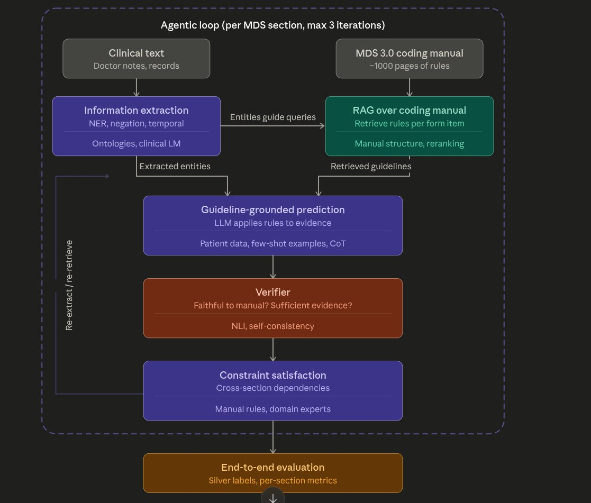
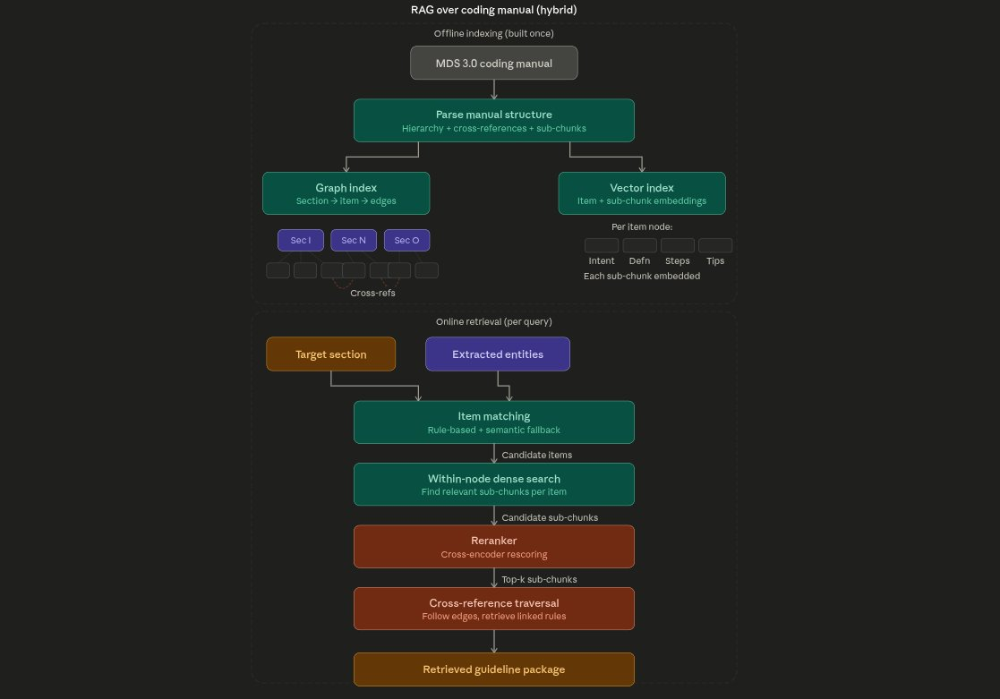

# MDS 3.0 Automated Form Completion: System Architecture & Design

## Overview

This document describes the full system architecture for automating MDS 3.0 (Minimum Data Set) clinical assessment form completion from unstructured clinical text. The system takes doctor notes and a ~1,000-page government coding manual as inputs, and produces a coded MDS 3.0 assessment form as output.

The system is designed as a general NLP pipeline for **knowledge-grounded structured prediction from long specification documents**. While MDS 3.0 is the primary evaluation domain, the architecture generalizes to any setting where a long procedural specification defines how to extract structured information from unstructured text (e.g., ICD coding, regulatory compliance, clinical trial eligibility).

---

## 1. Main System Architecture

### 1.1 Inputs

The system takes three inputs:

**Clinical Text** — Free-text documents written by doctors (discharge summaries, progress notes, nursing assessments, etc.). These are messy, full of abbreviations (MI = myocardial infarction, CHF = congestive heart failure), negations ("no evidence of pneumonia"), and implicit temporal distinctions ("history of stroke" vs. "admitted for acute stroke").

**Structured Data** — Already-coded records from clinical databases: ICD diagnosis codes, drug prescriptions with NDC/RxNorm identifiers, procedure codes, lab results, and associated metadata (dates, flags like present-on-admission, sequence numbers). These provide a complementary evidence source to the unstructured text — they are standardized but may be noisy (billing codes carried forward, historical conditions not filtered out).

**MDS 3.0 Coding Manual** — A ~1,000-page government document (the RAI User's Manual) that defines exactly how to code each item on the MDS form. It contains: section-level instructions, item-level coding rules with decision procedures, cross-references between items, look-back period definitions, coding tips and edge cases, and worked examples.

### 1.2 System Components



The system has five core components organized inside an **agentic loop** that iterates per MDS section (with a maximum of 3 iterations), plus an end-to-end evaluation step outside the loop.

---

#### Component 1: Information Extraction

**Purpose:** Read the clinical text and extract structured clinical facts relevant to the target MDS section. This component exists as a separate stage (rather than being merged into the prediction step) to reduce the data overload for downstream components — the LLM in the prediction step receives only extracted entities, not the full raw clinical text.

**Core NLP sub-tasks:**
- **Named Entity Recognition (NER):** Identify mentions of diseases, drugs, procedures, symptoms in the clinical text. This is section-aware — if the agentic loop is processing Section I (diagnoses), NER focuses on disease mentions; if processing Section N (medications), it focuses on drug mentions.
- **Negation/Assertion Detection:** Classify each extracted mention as affirmed, negated, or uncertain. "Patient has diabetes" → affirmed. "No evidence of pneumonia" → negated. "Possible UTI" → uncertain. Only affirmed mentions should result in checked boxes on the form.
- **Temporal Classification:** Classify each mention as current or historical. "History of stroke in 2015" → historical (do not check). "Admitted for acute stroke" → current (check). Discharge summary section headers help: "Past Medical History" vs. "Hospital Course" vs. "Active Problems."
- **Entity Linking:** Normalize different surface forms to standard codes. "Lasix" → furosemide → ATC code C03CA01 → MDS category "diuretic." "MI" → myocardial infarction → ICD code I21.x → MDS category "heart disease." Tools: RxNorm (drug normalization), UMLS (disease/concept normalization), ATC (drug classification).

**Supporting resources:**
- Medical ontologies (UMLS, RxNorm, ATC, ICD-10) for entity linking and normalization
- Clinical language models (BiomedBERT, clinical LLM fine-tunes) that understand medical abbreviations and context better than general-purpose models

**Dual-path design:** The IE component processes both unstructured and structured inputs (see Section 2 for the detailed IE architecture).

**Output:** A structured evidence package per MDS section containing: extracted entities with assertion status, temporal status, normalized codes, and source attribution (which sentence in the note, or which code in the structured tables).

**Connection to RAG:** The extracted entities flow into the RAG component to guide retrieval queries — extracted entities determine what coding rules to search for in the manual.

---

#### Component 2: RAG over Coding Manual

**Purpose:** Given the target MDS section and extracted entities from IE, retrieve the relevant coding rules from the ~1,000-page MDS manual. This uses a hybrid structure-aware graph RAG approach (see Section 3 for the detailed RAG architecture).

**Key design decisions:**
- Uses the manual's own hierarchical structure (sections → items → sub-parts) as the retrieval index, rather than unsupervised clustering
- Cross-references between manual sections are modeled as graph edges
- Decision procedures within items are kept intact (never fragmented across chunks)
- Two-level retrieval: navigate the graph to find relevant items, then dense search within items to find the most relevant sub-chunks
- Reranker (cross-encoder) rescores sub-chunks after within-node dense search for higher precision

**Supporting resources:**
- Manual structure parsing (table of contents, cross-reference detection)
- Reranking models (cross-encoders for more accurate relevance scoring)

**Output:** A retrieved guideline package containing: primary item coding instructions (the specific rules for the items being coded), cross-referenced rules from other sections, and general section-level rules (e.g., the definition of "active diagnosis").

---

#### Component 3: Guideline-Grounded Prediction

**Purpose:** Combine the extracted clinical evidence (from IE) with the retrieved coding rules (from RAG) to produce a coded answer for each MDS form item.

**How it works:** An LLM receives a structured prompt containing:
1. The extracted entities and their attributes (assertion, temporal status, normalized codes)
2. The retrieved manual instructions (intent, definition, decision steps, coding tips)
3. Patient demographic data (age, gender, admission type) when relevant to coding rules
4. Few-shot examples of correct codings (worked examples showing input evidence → correct coded answer)
5. Chain-of-thought (CoT) instructions asking the model to reason step-by-step through the manual's decision procedure rather than jumping to an answer

**Key design principle:** The LLM should follow the retrieved manual rules, not rely on its own parametric medical knowledge. The manual sometimes has very specific coding instructions that differ from general medical understanding (e.g., MDS defines "active diagnosis" differently than a clinician might casually interpret it).

**Output:** Per-item predictions with reasoning traces — for each MDS item, a coded value (0 or 1, or multi-level coding depending on the item) plus a step-by-step reasoning chain showing which evidence was used and which manual rule was applied.

---

#### Component 4: Verifier

**Purpose:** Check each coding prediction for faithfulness (is the answer actually supported by a manual rule?) and evidence sufficiency (is there enough clinical evidence to justify this answer?). This merged verifier combines per-item faithfulness checking with specification compliance verification.

**Methods:**
- **NLI (Natural Language Inference):** Check whether the retrieved manual rule logically supports/entails the coding decision given the clinical evidence. If the rule says "code diabetes only if it is actively affecting the care plan" and the evidence only shows a historical mention, NLI should flag a mismatch.
- **Self-consistency:** Run the prediction multiple times (with temperature > 0 or different prompt orderings) and flag items where the model gives different answers across runs — these are uncertain predictions that need re-examination.

**Behavior within the agentic loop:** The verifier runs up to 3 times per section. If a prediction fails verification:
- On failure: the system loops back to re-extract (IE might have missed something) and re-retrieve (RAG might have pulled the wrong rules)
- After 3 failed attempts: the system accepts the current prediction and flags it as low-confidence

**Output:** Verified predictions with confidence scores, or rejection signals that trigger re-iteration through the loop.

---

#### Component 5: Constraint Satisfaction

**Purpose:** After individual items are verified, check whether the full set of predictions across sections is internally consistent. MDS form items are not independent — there are logical dependencies between sections.

**Examples of cross-section constraints:**
- If "dialysis" is checked in Section O (treatments), then "renal failure" or "kidney disease" should be checked in Section I (diagnoses)
- If "antipsychotic medication" is checked in Section N (medications), there should be a psychiatric diagnosis in Section I
- If "IV medications" is checked in Section O, the specific medications should appear in Section N
- If "diabetes" is checked in Section I, insulin or oral hypoglycemics might be expected in Section N

**Sources of constraints:**
- **Manual rules:** The MDS manual explicitly defines some of these dependencies through cross-references between sections
- **Domain experts:** Nurses who actually fill these forms in practice have institutional knowledge about which combinations are expected and which are suspicious

**Output:** Either a consistent set of predictions (passed), or identified conflicts that trigger re-iteration through the agentic loop for the affected sections.

---

#### Agentic Loop

The five components above operate inside an **agentic loop** that:
- Runs **per MDS section** (or potentially groups of related sections)
- Iterates at most **3 times** per section (controlled by the verifier)
- Terminates when either: all predictions pass verification and constraint satisfaction, or the maximum iteration count is reached
- Processes sections in order: Section I (diagnoses) → Section N (medications) → Section O (treatments), though the constraint satisfaction step may trigger re-processing of earlier sections

The feedback path goes from constraint satisfaction back to information extraction, allowing re-extraction and re-retrieval on subsequent iterations.

---

#### End-to-End Evaluation

**Purpose:** Measure the full system's performance by comparing the completed MDS form against evaluation data.

**Evaluation approach:**
- **Silver labels:** Since no gold-standard MDS labels exist for clinical datasets like MIMIC-IV, approximate ground truth is constructed from structured tables — mapping ICD diagnosis codes to Section I items, drug prescription codes to Section N items, and procedure codes to Section O items
- **Per-section metrics:** Precision, recall, F1 per MDS section and per individual item
- **End-to-end evaluation:** Run the full pipeline on test patients and compare against silver labels
- **Component-level ablations:** Evaluate the contribution of each component by removing it and measuring the performance drop (e.g., system with RAG vs. without RAG, system with verifier vs. without)

---

## 2. Information Extraction: Detailed Architecture


The IE component uses a **dual-path design** — processing both unstructured clinical text and structured coded tables in parallel, then fusing the results.

### 2.1 Target Section Control

The agentic loop provides the **target MDS section** as input to IE. This controls both paths:
- **Unstructured path:** Guides what types of entities to extract (diseases for Section I, drugs for Section N, procedures for Section O)
- **Structured path:** Guides which code-to-MDS mappings and temporal filters to apply

### 2.2 Unstructured Path (Clinical Notes → Extracted Entities)

This path processes free-text doctor notes through a four-stage pipeline:

**Stage 1: Section-Aware NER**
- Extract entity mentions relevant to the target MDS section
- For Section I: look for disease/condition mentions (e.g., "heart failure," "COPD," "UTI")
- For Section N: look for drug mentions (e.g., "Lasix," "metoprolol," "insulin drip")
- For Section O: look for treatment/procedure mentions (e.g., "dialysis," "ventilator," "chemotherapy")
- Tools: MedCAT, scispaCy, or clinical LLM-based extraction
- Output: a list of entity mentions with their positions in the text

**Stage 2: Assertion Classification**
- For each extracted mention, classify its assertion status:
  - **Affirmed:** "Patient has diabetes" → the condition IS present
  - **Negated:** "No evidence of pneumonia," "denies chest pain" → the condition is NOT present
  - **Uncertain:** "Possible UTI," "cannot rule out PE" → uncertain whether present
- Only affirmed mentions should result in checked MDS items
- Negated mentions are important too — they provide negative evidence that should prevent checking a box even if other signals suggest it
- Methods: Transformer-based assertion classifiers, or LLM prompting with explicit assertion instructions

**Stage 3: Temporal Classification**
- For each affirmed mention, classify its temporal status:
  - **Current:** "Admitted for acute stroke," "currently on insulin" → happening now, relevant to MDS
  - **Historical:** "History of MI in 2019," "prior hip replacement" → happened in the past, may not be relevant depending on the look-back period
- Discharge summary section headers are strong signals: mentions in "Past Medical History" are typically historical, mentions in "Hospital Course" or "Active Problems" are typically current
- The look-back period from the target MDS section's coding rules determines how far back to consider — some items care about the last 7 days, others the last 14 days, others are open-ended
- Methods: Rule-based (section header detection) + LLM-based (contextual temporal reasoning)

**Stage 4: Entity Linking**
- Normalize each extracted, affirmed, current mention to a standard medical code
- Drug mentions → RxNorm generic name → ATC classification code → MDS drug category
  - Example: "Lasix" → furosemide → ATC C03CA01 → MDS "diuretic"
  - Example: "Seroquel" → quetiapine → ATC N05AH04 → MDS "antipsychotic"
- Disease mentions → UMLS concept → ICD-10-CM code → MDS diagnosis category
  - Example: "CHF" → congestive heart failure → ICD I50.9 → MDS "heart failure"
  - Example: "sugar" (colloquial) → diabetes mellitus → ICD E11.9 → MDS "diabetes"
- Procedure mentions → ICD-10-PCS code → MDS treatment category
  - Example: "on the vent" → mechanical ventilation → PCS 5A1945Z → MDS "ventilator/respirator"
- Tools: RxNorm API, UMLS Metathesaurus, QuickUMLS, or MedCAT for end-to-end linking

### 2.3 Structured Path (Coded Tables → Coded Evidence)

This path processes already-standardized medical codes through a three-stage pipeline:

**Stage 1: Code-to-MDS Mapping**
- Map standardized codes from clinical databases to MDS form items
- **ICD-10-CM diagnosis codes → Section I items:** The mapping is many-to-one. MDS has ~70 diagnosis checkboxes, but ICD has tens of thousands of codes. For example, MDS has one checkbox for "heart failure," but ICD has dozens of heart failure codes (I50.1, I50.20, I50.30, I50.9, I11.0, I13.x, etc.). All of these map to the same MDS checkbox. CMS publishes partial crosswalks, but they're incomplete — custom mapping tables are needed.
- **Drug codes (NDC/RxNorm) → Section N items via ATC classification:** Prescription records contain drug identifiers. ATC classification maps drugs to MDS categories: all ATC codes under N05A map to "antipsychotic," all under N05B map to "antianxiety," all under C03 map to "diuretic," etc.
- **ICD-10-PCS procedure codes → Section O items:** Procedure codes map more directly to MDS treatment items. Dialysis codes (5A1D series) → "dialysis" checkbox. Mechanical ventilation codes (5A19 series) → "ventilator" checkbox. Transfusion codes → "transfusion" checkbox.

**Stage 2: Temporal Filtering**
- Filter codes by the relevant time window for the target MDS section
- Use dates from the structured tables: admission date, discharge date, procedure dates, prescription start/stop dates, order dates
- Apply the look-back period from the MDS coding rules (7 days, 14 days, or since last assessment)
- A dialysis procedure code from 6 months ago is not relevant to the current MDS assessment; one from this admission is

**Stage 3: Active Status Check**
- Determine whether each code represents an active condition (relevant to current care) vs. a historical one (carried forward in records but not actively affecting care)
- Use available flags: present-on-admission (POA) indicators tell you whether the condition existed before the hospital stay; discharge diagnosis lists vs. historical diagnosis lists; DRG (diagnosis-related group) codes indicate which diagnoses drove the hospital stay
- This is the weakest part of the structured path — flags are imperfect, which is exactly why the unstructured path is needed as a complement

### 2.4 Evidence Fusion

Both paths produce evidence for the same MDS items. The fusion step merges them:

**Agreement cases:** Both paths support the same item → high confidence. The note says "active heart failure" AND the ICD code I50.9 is present → strong evidence to check the heart failure box.

**Conflict cases:** The paths disagree → needs resolution.
- Note says "no pneumonia" but ICD code J18.9 (pneumonia) is present → the note is more likely correct (ICD codes can be carried forward from initial workup even after a condition is ruled out). Strategy: trust the note's negation.
- Note mentions "furosemide" but no matching prescription record exists → could be an outpatient medication mentioned in the note but not in hospital records. Strategy: include with lower confidence.
- Structured codes show a diagnosis but the note doesn't mention it → could be a billing code without clinical significance. Strategy: include with a flag for the verifier to check.

**Output:** A structured evidence package per MDS section containing:
- For each relevant MDS item: the evidence sources (text mention, coded table, or both), assertion status, temporal status, normalized code, confidence score, and source attribution
- Negative evidence: items where explicit negation was found (to prevent false positives)

---

## 3. RAG over Coding Manual: Detailed Architecture



The RAG component uses a **hybrid structure-aware graph RAG** approach. Rather than treating the manual as flat text and relying on unsupervised clustering (like RAPTOR), it exploits the manual's existing hierarchical structure and adds dense vector search within nodes for fine-grained retrieval.

### 3.1 Why Not RAPTOR-style Clustering?

Three reasons this problem calls for a different approach:

1. **The manual is already structured.** RAPTOR discovers document structure through unsupervised clustering. But the MDS manual has an explicit hierarchy (sections → items → sub-parts) defined by its table of contents. Rediscovering this structure through clustering adds complexity and introduces errors (chunks might be assigned to wrong clusters).

2. **Cross-references are graph edges, not tree branches.** The manual's cross-references ("see also Section GG," "if dialysis is coded in O0100, check renal disease in I0300") create lateral connections between sections. RAPTOR's tree structure doesn't naturally represent graph-like cross-references.

3. **Decision procedures must stay intact.** Some MDS coding instructions are step-by-step procedures ("Step 1: check if X; Step 2: if yes, determine Y; Step 3: code Z"). Chunking these across multiple fragments and hoping retrieval reassembles them is fragile. They should be retrievable as complete units.

### 3.2 Offline Indexing (Built Once)

**Step 1: Parse Manual Structure**
- Parse the table of contents to extract the section → item hierarchy
- For each MDS item (e.g., I0100, I0200, N0300, O0100), extract its complete coding instructions as a single document containing: intent, definition, steps for assessment (decision procedure), coding tips and edge cases, look-back period, and examples
- Scan each item's text for cross-reference phrases ("see also," "refer to," "in conjunction with," "if [condition in another section]") and create edges between items

**Step 2: Build Graph Index**
- **Nodes:** Each MDS section is a node; each item within a section is a child node
- **Parent-child edges:** Section I → {I0100, I0200, I0300, ...}; Section N → {N0300, N0350, N0400, ...}; etc.
- **Cross-reference edges:** Item-to-item edges from detected cross-references (e.g., I0300 → O0100 if the manual says renal disease coding relates to dialysis treatment)

**Step 3: Build Two-Level Vector Index**
- **Item-level embeddings:** Embed each item node's full content. Used during online retrieval for semantic item matching when rule-based matching fails.
- **Sub-chunk embeddings:** Within each item node, split the content into logical sub-chunks (one for intent, one for definition, one per decision step, one per coding tip, etc.). Embed each sub-chunk and tag it with its parent item ID. Used during within-node dense search to find the most relevant passages within a long item.

**Result:** A graph of section → item nodes with cross-reference edges, plus a two-level vector index (item-level + sub-chunk-level).

### 3.3 Online Retrieval (Per Query)

Inputs: the target MDS section (from the agentic loop) and extracted entities (from IE).

**Step 1: Item Matching**
- Navigate to the target section node in the graph (trivial — direct pointer)
- For each extracted entity, find matching item nodes within the target section
- **Rule-based matching (primary):** If entity linking has normalized the entity to a standard code (e.g., furosemide → ATC C03CA01), use a prebuilt mapping table from codes to MDS items (ATC C03 → item N0400 "diuretics"). This is fast and deterministic.
- **Semantic matching (fallback):** For entities that weren't normalized (maybe the abbreviation wasn't recognized, or it's an unusual phrasing), encode the entity as a vector and compare against item-level embeddings within the target section. Take the top matches by cosine similarity.
- Output: a set of candidate items (typically 5–10 per section)

**Step 2: Within-Node Dense Search**
- For each candidate item, search its sub-chunk embeddings using the extracted entities as the query
- This finds the most relevant paragraphs within each item's coding instructions
- Example: Heart failure item (I0200) might have 15 sub-chunks, but if the extracted entity is "CHF with preserved ejection fraction," the sub-chunk about preserved vs. reduced ejection fraction is most relevant
- Output: a pool of candidate sub-chunks across all candidate items

**Step 3: Reranker (Cross-Encoder Rescoring)**
- Take all candidate sub-chunks from Step 2 and re-score them using a cross-encoder model
- Cross-encoders are more accurate than bi-encoder (embedding) similarity because they see the query and passage together, allowing fine-grained token-level attention
- The reranker filters and re-orders the sub-chunks, keeping only the top-k most relevant ones
- This is the quality gate — it ensures only the most relevant passages make it into the guideline package
- Output: top-k sub-chunks ranked by relevance

**Step 4: Cross-Reference Traversal**
- Check whether any of the top-k items have outgoing cross-reference edges in the graph
- If item I0300 (hypertension) has a cross-reference edge to O0100 (dialysis), and the patient has relevant evidence, follow the edge
- For each linked item: repeat Steps 2–3 (within-node dense search + reranking) to find the most relevant sub-chunks from the linked item
- Control traversal depth: typically 1 hop is sufficient; 2 hops for complex cases
- Output: additional sub-chunks from cross-referenced items

**Step 5: Assemble Guideline Package**
- Combine the top-k sub-chunks from primary items and cross-referenced items
- Add section-level general rules (e.g., the definition of "active diagnosis" that applies to all of Section I, or the general medication coding instructions for Section N)
- Structure the package for the prompt: primary rules first, cross-referenced rules second, general rules third
- Output: a compact, structured guideline package ready for the guideline-grounded prediction step

---

## 4. Data Flow Summary

```
Clinical Text ──→ Information Extraction ──→ Evidence Package ──┐
                        ↓ (entities guide queries)               │
                  RAG over Coding Manual ──→ Guideline Package ──┤
                                                                  ↓
MDS Manual ──→ [Offline: Graph + Vector Index]     Guideline-Grounded Prediction
                                                                  ↓
                                                            Verifier (max 3x)
                                                                  ↓
                                                     Constraint Satisfaction
                                                                  ↓
                                                      End-to-End Evaluation
```

The agentic loop wraps: IE → RAG → Prediction → Verifier → Constraint Satisfaction, with feedback from Constraint Satisfaction back to IE for re-extraction/re-retrieval.

---

## 5. Implementation Priorities

For a course project or prototype implementation, the recommended build order is:

1. **Silver Label Factory** — Build code-to-MDS mapping tables (ICD → Section I, ATC → Section N, PCS → Section O) so you have evaluation data. This unblocks everything else.
2. **Baseline extraction** — Prompt an LLM with raw clinical text and ask it to fill the form without any manual guidance. This measures how well parametric knowledge alone works.
3. **Manual-grounded prompting** — Manually select relevant manual pages and include them in the prompt. Measure the delta over the baseline.
4. **IE pipeline** — Build the dual-path extraction system (unstructured + structured + fusion).
5. **RAG pipeline** — Build the structure-aware graph index and hybrid retrieval system.
6. **Verifier** — Add NLI-based verification and self-consistency checking.
7. **Constraint satisfaction** — Add cross-section dependency checking.
8. **End-to-end evaluation** — Run the full pipeline and compare against silver labels.

Steps 1–3 are sufficient for a course project. Steps 4–8 build toward the full PhD system.

---

## 6. Key Research Questions per Component

| Component | Research Question |
|-----------|-------------------|
| Information Extraction | Does dual-path (text + codes) outperform single-path? How much does section-aware NER help vs. extract-everything? |
| RAG over Coding Manual | Does structure-aware graph RAG outperform flat dense retrieval? Does within-node dense search help for long items? How much do cross-references contribute? |
| Guideline-Grounded Prediction | Does providing retrieved guidelines improve over parametric-only? Does CoT improve faithful rule-following? How sensitive is performance to retrieval quality? |
| Verifier | Does NLI-based verification catch unfaithful predictions? Does self-consistency correlate with accuracy? How many iterations does the loop typically need? |
| Constraint Satisfaction | How many cross-section conflicts exist in practice? Does constraint-based correction improve overall accuracy? |


## 8. Known Challenges and Limitations

- **Domain mismatch:** Available clinical datasets (e.g., MIMIC-IV) are hospital data; MDS 3.0 is designed for long-term care (nursing homes). Hospital discharge summaries serve as a proxy evaluation environment, and this mismatch should be explicitly acknowledged in any evaluation.
- **No gold labels:** No gold-standard MDS annotations exist for any public clinical dataset. Silver labels constructed from coded tables are approximate and may contain errors. Human evaluation on a sample is needed to validate.
- **Manual parsing:** Automatically parsing the MDS manual's structure, decision trees, and cross-references is itself a non-trivial NLP task. Some manual annotation may be needed for the initial graph construction.
- **Entity linking coverage:** Not every clinical mention can be reliably linked to a standard code. Rare conditions, unusual abbreviations, and colloquial terms may fail linking. The semantic matching fallback in RAG partially mitigates this.
- **Constraint completeness:** The set of cross-section constraints is not exhaustive. Manual rules cover some, domain experts cover more, but there will be valid predictions that look inconsistent by the rules but are actually correct edge cases.

---

## 9. IE Component: Two-Layer Design

The IE component is decomposed into two layers: a **general core (Layer 1)** that handles schema-driven extraction from unstructured and structured inputs, and a **domain adapter (Layer 2)** that provides task-specific and dataset-specific configuration. This separation ensures the core extraction logic is reusable across domains — only the adapter changes when moving from MDS form completion to ICD coding, legal compliance, or any other specification-grounded extraction task.

### 9.1 The Core Problem the IE Component Solves

Given some rules that define what information matters (entity types, their attributes, and how to filter them), extract that information from both unstructured text and structured data, then merge the results into a single evidence package. The rules come from the specification document and the target task; the IE component's job is to follow those rules.

### 9.2 Layer 1 — General Core

Layer 1 is the extraction engine. It does not know anything about medicine, law, or any specific domain. It operates on an **extraction schema** — a structured definition that tells it what to extract and how to classify what it finds. The schema replaces the hardcoded "Target MDS section" from the original design.

**What the extraction schema contains:**

The schema defines the entity types to extract (what kinds of things to look for in the text), the attribute dimensions to classify on each entity (what properties matter for downstream decision-making), and the configuration for handling structured data sources (which tables to read, which columns contain codes, which columns contain dates). It also defines fusion rules for how to resolve disagreements between the unstructured and structured paths.

The schema is the single control input to the IE component. Everything the IE pipeline does is driven by what the schema says. If the schema says "extract diseases and classify each one on assertion status and temporality," the pipeline extracts diseases and classifies them on those two dimensions. If a different schema says "extract contractual obligations and classify each one on obligation type and enforceability," the same pipeline does that instead — no code changes, just a different schema.

**What Layer 1 does, step by step:**

On the **unstructured path**, Layer 1 takes the input text and the schema's entity type definitions, and uses an LLM to extract entity mentions that match those types. For each extracted mention, it then runs attribute classification — again driven by the schema, which defines what attributes exist and how to classify them (the schema provides classification instructions that go into the LLM prompt). After classification, Layer 1 calls an entity normalization interface — an abstract step where it hands each entity to a domain adapter and gets back a normalized code. Layer 1 doesn't know how normalization works; it just knows that the adapter returns a code or says "can't normalize this."

On the **structured path**, Layer 1 takes the structured data and the schema's structured source configuration. It maps each code in the structured data to a target schema item using a mapping table provided by the adapter. It filters by date using the schema's look-back period. It checks active status using flags specified by the adapter. All of this is mechanical — the logic is general (filter by date, check flags), but the specific tables, columns, codes, and flags come from the schema.

In the **fusion step**, Layer 1 merges evidence from both paths. It groups mentions by which schema item they map to, checks for agreement or conflict between the paths, computes confidence scores, and produces the final evidence package. The fusion rules (e.g., "if the text negates something but the code is present, trust the text") are defined in the schema, so different domains can specify different conflict resolution strategies.

**What Layer 1 does NOT do:**

Layer 1 does not know what a "disease" or "drug" is. It does not know how to normalize "Lasix" to "furosemide." It does not know that ICD code I50.9 means heart failure. It does not know that "Past Medical History" is a section header that signals historical information. All of that knowledge lives in Layer 2.

### 9.3 Layer 2 — Domain Adapter

Layer 2 is where all task-specific and dataset-specific knowledge lives. It provides the extraction schema that Layer 1 operates on, and it implements the domain-specific operations that Layer 1 calls through abstract interfaces.

**What Layer 2 provides:**

First, it provides the **extraction schema configuration** for the target task. For MDS Section I, this means defining "disease" as the entity type with a description and examples, defining "assertion" and "temporality" as the attribute dimensions with classification instructions, specifying the ICD-to-MDS mapping tables, specifying which MIMIC tables to read and which columns to use, and defining the fusion rules for clinical data.

Second, it provides the **entity normalization implementation**. For the clinical domain, this means connecting to medical ontologies (RxNorm for drugs, UMLS for diseases, ATC for drug classification) to normalize surface forms to standard codes. For a legal domain, this would be a different normalizer that maps contract terms to a legal taxonomy. Layer 1 calls the same interface; Layer 2 plugs in the right implementation.

Third, it provides **dataset-specific configuration**: which tables exist in MIMIC-IV, what the column names are, what the present-on-admission flags mean, which section headers appear in discharge summaries and what temporal signal they carry. When the dataset changes (e.g., from MIMIC to actual long-term care notes), only this part of Layer 2 changes.

**What Layer 2 does NOT do:**

Layer 2 does not contain extraction logic, attribute classification logic, fusion logic, or confidence scoring logic. Those are all in Layer 1. Layer 2 only provides configuration and domain-specific implementations of the normalization interface.

### 9.4 How Layer 1 and Layer 2 Interact at Runtime

The cleanest way to understand the two-layer design is to view it as a **stable engine + replaceable adapter** pattern.

Layer 1 owns the execution flow. It knows that extraction has to happen in a particular order: prepare schema → read text and structured sources → extract evidence from both paths → normalize if possible → map evidence to target items → fuse results → output an evidence package. That flow is fixed across domains.

Layer 2 is plugged into that flow. It does not change the execution logic; instead, it fills in the domain-specific blanks. It tells Layer 1 what entity types exist, what attributes to classify, how to normalize mentions, how to map structured codes to target items, which data sources matter, and how to interpret domain-specific metadata.

At runtime, the interaction looks like this:

1. The caller selects a **task adapter** (for example, `MDS_MIMIC_Section_I_Adapter`).
2. The adapter returns an **extraction schema** for that task.
3. Layer 1 uses the schema to run the unstructured extractor over notes.
4. Layer 1 uses the schema to run the structured extractor over coded tables.
5. Whenever Layer 1 needs a domain-specific operation, it calls an adapter interface:
   - `normalize_entity(...)`
   - `map_code_to_target(...)`
   - `check_active_status(...)`
   - `resolve_temporal_context(...)`
6. Layer 1 receives standardized outputs from those interfaces and continues processing.
7. Layer 1 fuses all evidence into a unified package, independent of how the adapter implemented the domain-specific steps.

This division is important because it keeps the system from collapsing into task-specific spaghetti code. The orchestration and data flow stay general, while domain knowledge remains modular and replaceable.

### 9.5 The Main Interfaces Between the Two Layers

To make the design implementable, the boundary between Layer 1 and Layer 2 should be defined through explicit interfaces rather than loose conventions.

The most important interfaces are:

#### A. Extraction Schema Provider

This interface returns the full schema that Layer 1 should follow for the current task.

The schema should specify:

- the target task or form section
- the entity types to extract
- the attribute dimensions to classify
- the allowed label set for each attribute
- the unstructured sources to read
- the structured sources to read
- the look-back period logic
- the fusion policy
- the confidence policy
- the target item inventory

In other words, this is the control document for the whole IE pipeline.

#### B. Entity Normalizer

This interface receives a raw extracted mention and returns a normalized representation if one is available.

For example, in a clinical adapter:
- `"Lasix"` may normalize to `furosemide`
- then to an RxNorm identifier
- then optionally to an ATC class
- then to an MDS medication category

The key point is that Layer 1 should not know how this happens. It only knows that the adapter may return:
- a canonical label
- one or more ontology codes
- a confidence score
- or `null` / `unresolved` if normalization fails

#### C. Structured Code Mapper

This interface maps already-coded structured records to target task items.

Examples:
- ICD-10 code `I50.9` → MDS Section I heart failure item
- ATC class `C03` → MDS Section N diuretics item
- ICD-10-PCS ventilation procedure → MDS Section O ventilator item

Layer 1 uses this interface after reading structured tables. Again, the mapping logic belongs to the adapter, not to the core engine.

#### D. Active/Temporal Resolver

This interface interprets domain-specific evidence state.

Examples in the clinical domain:
- a diagnosis in `Past Medical History` should usually be historical
- a medication in `eMAR` may be stronger evidence than a medication only in `prescriptions`
- a procedure outside the look-back window should be filtered out
- a diagnosis code present only as a legacy carry-forward entry may not count as active

Layer 1 applies the decision, but Layer 2 defines the rules and metadata interpretation.

#### E. Fusion Policy Provider

This interface defines how conflicts are resolved.

For example:
- if the note explicitly negates pneumonia but an ICD code for pneumonia exists, trust the note
- if a structured medication record exists and the note is silent, keep the evidence with moderate confidence
- if both paths agree, boost confidence
- if normalization is missing, keep the mention but lower confidence

This prevents fusion behavior from being hidden inside ad hoc if-statements across the codebase.

### 9.6 Canonical Data Model for the IE Core

For the implementation to remain clean, Layer 1 should operate on a small set of canonical data structures. The exact programming language does not matter; what matters is that these objects are explicit and stable.

A good minimal set is:

#### 1. `ExtractionSchema`

This object defines what the system should extract and how.

Suggested fields:

```yaml
task_name: "MDS Section I"
target_domain: "clinical"
target_items:
  - item_id: "I0200"
    name: "Heart Failure"
  - item_id: "I0300"
    name: "Diabetes"
entity_types:
  - name: "disease"
    description: "Clinical condition or diagnosis relevant to the target section"
attributes:
  - name: "assertion"
    labels: ["affirmed", "negated", "uncertain"]
  - name: "temporality"
    labels: ["current", "historical", "planned", "unknown"]
unstructured_sources:
  - source_name: "discharge_summary"
structured_sources:
  - source_name: "diagnoses_icd"
lookback_policy:
  type: "task_defined"
fusion_policy:
  strategy: "schema_defined"
normalization_mode: "optional"
```

#### 2. `Mention`

This represents one extracted span from unstructured text.

Suggested fields:

```yaml
mention_id: "m1"
text: "acute decompensated heart failure"
entity_type: "disease"
char_start: 128
char_end: 160
source_document_id: "note_001"
context_window: "Hospital course: patient treated for acute decompensated heart failure..."
attributes:
  assertion: "affirmed"
  temporality: "current"
normalization:
  canonical_name: "heart failure"
  codes:
    - system: "ICD10"
      code: "I50.9"
  confidence: 0.86
```

#### 3. `StructuredEvidence`

This represents one coded record from a structured table after mapping and filtering.

Suggested fields:

```yaml
evidence_id: "s1"
source_table: "diagnoses_icd"
raw_code: "I50.9"
code_system: "ICD10"
mapped_target_items: ["I0200"]
timestamp: "2180-05-02"
active_status: "likely_active"
confidence: 0.78
metadata:
  seq_num: 2
```

#### 4. `EvidenceRecord`

This is the fused object consumed by downstream components.

Suggested fields:

```yaml
target_item_id: "I0200"
target_item_name: "Heart Failure"
supporting_mentions: ["m1"]
supporting_structured_evidence: ["s1"]
final_status: "supported"
confidence: 0.91
conflict_flags: []
negative_evidence: []
reason_summary: "Affirmed current mention in discharge summary agrees with ICD diagnosis code."
```

These canonical objects are what make the architecture programmable. Once they exist, different adapters can reuse the same core pipeline.

### 9.7 What the Unstructured Path Should Look Like in the Two-Layer Design

The unstructured path in Layer 1 should be implemented as a schema-driven sequence of generic steps:

1. **Document preparation**
   - split the input corpus into documents
   - identify document type
   - optionally segment by section headers

2. **Schema-conditioned extraction**
   - prompt the extractor with the schema's entity types and definitions
   - ask for all matching mentions in the text
   - return spans and evidence context

3. **Schema-conditioned attribute classification**
   - for each mention, classify all requested attributes
   - the labels come from the schema, not hardcoded logic

4. **Optional normalization**
   - call the adapter to normalize the mention
   - if normalization fails, preserve the raw mention

5. **Target-item candidate assignment**
   - use normalized codes if available
   - otherwise use adapter-provided lexical or semantic fallback mapping

This means the unstructured path is not "medical IE." It is a general schema-following extraction routine.

### 9.8 What the Structured Path Should Look Like in the Two-Layer Design

The structured path should also be fully schema-driven.

Its generic logic is:

1. read the structured sources named in the schema
2. locate the code/date/status columns defined by the adapter
3. map raw codes to target items using the adapter
4. filter records by look-back period
5. apply active-status logic
6. convert retained records into canonical `StructuredEvidence` objects

This makes the structured path reusable even outside healthcare. The only thing that changes is the adapter:
- in clinical data, the records are ICD/RxNorm/PCS rows
- in legal compliance, they could be database flags and contract metadata
- in finance, they could be transaction codes and audit tags

The Layer 1 logic remains unchanged.

### 9.9 Optional Normalization Is a First-Class Design Choice

The normalization adapter should be treated as **optional but pluggable**, not as an all-or-nothing requirement.

This is especially important for your project because a robust clinical normalization stack may take significant time to build. The IE design should therefore support three modes:

#### Mode A: Full normalization
The adapter resolves mentions to canonical concepts and codes. This gives the strongest mapping quality and best compatibility with the structured path.

#### Mode B: Weak normalization
The adapter resolves only some mentions, such as obvious synonyms or known dictionary matches, while leaving others unresolved.

#### Mode C: No normalization
The adapter returns unresolved mentions, and Layer 1 continues with raw text spans plus semantic candidate matching.

This matters for research as well as engineering. It allows you to ask a meaningful question:

> How much does downstream MDS extraction depend on full ontology normalization, and how much can be recovered by schema-guided extraction plus retrieval or semantic mapping?

From an implementation standpoint, this means Layer 1 should never crash or stop because normalization failed. Unresolved mentions are still valid evidence objects.

### 9.10 Example: An MDS-on-MIMIC Adapter for Section I

To make the abstraction concrete, consider a first adapter for **MDS Section I (diagnoses)** using MIMIC-style data.

The adapter would define:

- **target items:** the subset of Section I diagnosis items you want to support
- **entity type:** `disease`
- **attributes:** `assertion`, `temporality`
- **unstructured sources:** discharge summary text
- **structured sources:** diagnosis tables
- **normalizer:** optional disease normalizer
- **structured code mapper:** ICD diagnosis to Section I item mapping
- **temporal resolver:** discharge summary header heuristics + admission/discharge time windows
- **fusion policy:** note negation overrides stale structured code; note+code agreement boosts confidence

The core engine would not know that these are clinical diagnoses. It would simply execute the schema.

The same core engine could later run:

- **MDS Section N adapter**
  - entity type: medication
  - structured sources: prescriptions, eMAR
  - mapper: drug class to medication item

- **MDS Section O adapter**
  - entity type: treatment/procedure
  - structured sources: procedures, ICU events
  - mapper: procedure code to special treatment item

- **Non-MDS adapter**
  - different entity inventory
  - different attributes
  - different mapping tables
  - same engine

That is the main architectural payoff of the two-layer design.

### 9.11 How the Output of IE Should Be Structured for the Next Stage

The IE output should not be a flat list of extracted entities. It should be a **task-grounded evidence package** that is directly consumable by the next component.

A good IE output should contain, for each target item:

- positive evidence from text
- negative evidence from text
- supporting structured evidence
- temporal interpretation
- normalization result, if available
- confidence score
- provenance
- unresolved conflicts

In other words, IE should already translate raw observations into a form that downstream reasoning can use.

For example, the RAG or prediction component should not need to rediscover that:
- the mention was negated
- the evidence came from a discharge summary
- the structured code was outside the look-back window
- the note and the structured record disagreed

All of that should already be resolved or at least explicitly represented in the IE output.

### 9.12 Recommended Module Decomposition for Implementation

To make the design easier for an LLM to turn into code, the implementation should be decomposed into clear modules.

A clean project structure would look like this:

```text
ie/
  core/
    schemas.py
    models.py
    interfaces.py
    orchestrator.py
    unstructured_pipeline.py
    structured_pipeline.py
    fusion.py
    confidence.py
  adapters/
    mds_mimic/
      section_i_adapter.py
      section_n_adapter.py
      section_o_adapter.py
      mappings/
      prompts/
      heuristics.py
  tests/
```

The responsibilities should be:

- `schemas.py`  
  defines schema objects and validation

- `models.py`  
  defines canonical data structures such as `Mention`, `StructuredEvidence`, and `EvidenceRecord`

- `interfaces.py`  
  defines abstract interfaces that adapters must implement

- `orchestrator.py`  
  runs the end-to-end IE flow for a selected adapter/schema

- `unstructured_pipeline.py`  
  runs schema-driven extraction, attribute classification, and optional normalization

- `structured_pipeline.py`  
  reads structured sources, maps codes, filters by time, and checks active status

- `fusion.py`  
  merges evidence from both paths

- `confidence.py`  
  computes calibrated or rule-based confidence scores

- `section_i_adapter.py`  
  contains the MDS Section I domain and dataset configuration

This structure ensures that when you later move beyond MIMIC, you mostly replace the adapter instead of rewriting the engine.

### 9.13 The Minimal End-to-End Flow the First Version Should Support

A minimal but correct implementation of the two-layer design should support the following call pattern:

1. select an adapter
2. load the schema from that adapter
3. pass notes and structured rows into the core orchestrator
4. run the unstructured path
5. run the structured path
6. fuse evidence by target item
7. return a structured evidence package

In practical terms, the first version does **not** need to include:
- perfect normalization
- advanced calibration
- learned fusion
- production-scale ontology linking
- multi-note temporal reasoning across long timelines

The first version only needs to preserve the architectural separation correctly. That is more important than optimizing every component early.

### 9.14 Why This Two-Layer Design Matters Scientifically

This decomposition is not only good software engineering; it also creates a stronger research contribution.

If the system were implemented as one monolithic "clinical IE for MDS" pipeline, it would be hard to claim any general insight beyond that task. But with the two-layer design, you can make broader claims:

- the extraction core is a reusable framework for specification-grounded IE
- the adapter pattern is what connects that general framework to a particular domain
- clinical MDS on MIMIC is one instantiation, not the whole story
- later, real home-care MDS data becomes another instantiation
- the same architecture could be adapted to other structured prediction tasks defined by long manuals or rulebooks

This supports a more meaningful PhD narrative: the contribution is not merely a dataset-specific pipeline, but a general extraction architecture for rule-governed form completion.

### 9.15 Final Summary of the Two-Layer IE Design

The IE component should be understood as follows:

- **Layer 1 is the reusable engine.**  
  It knows how to run schema-driven extraction over unstructured and structured inputs, normalize when possible, fuse evidence, and produce a task-grounded evidence package.

- **Layer 2 is the domain adapter.**  
  It defines what to extract, how to interpret it, how to map it to target items, and how to configure the core for a particular domain and dataset.

- **The schema is the contract between the two.**  
  The schema tells the engine what the task is, and the adapter provides the domain-specific machinery needed to execute that task.

- **Normalization is optional, not mandatory.**  
  The design should support both rich ontology-backed adapters and lightweight adapters that rely mostly on schema-guided extraction and weak mapping.

- **The output is not raw entities but fused evidence organized by target item.**  
  This is what makes the IE module useful for downstream reasoning, retrieval, and verification.

That is the complete conceptual unit that should be implemented in code.
